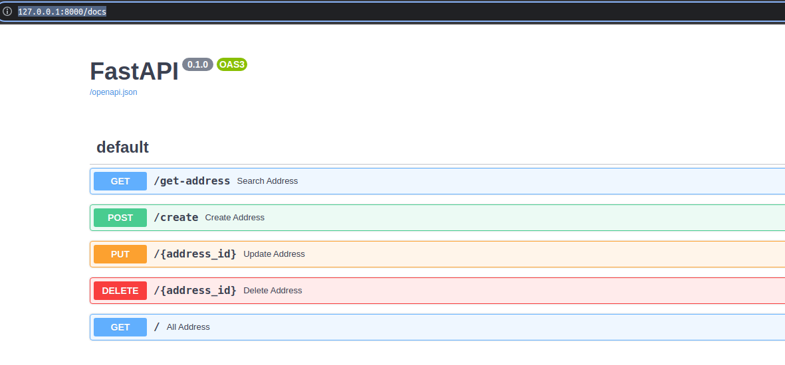
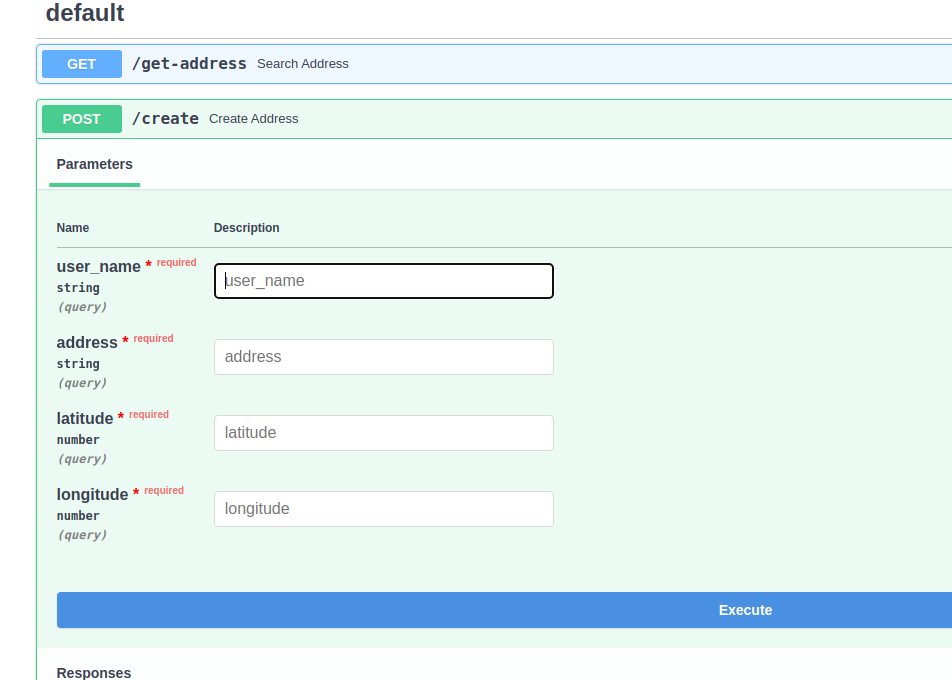
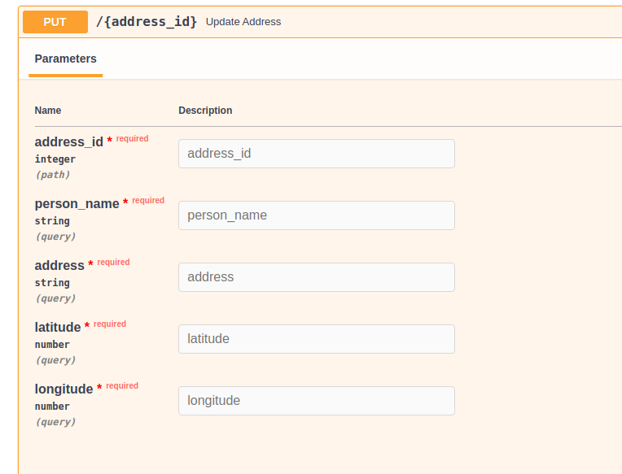
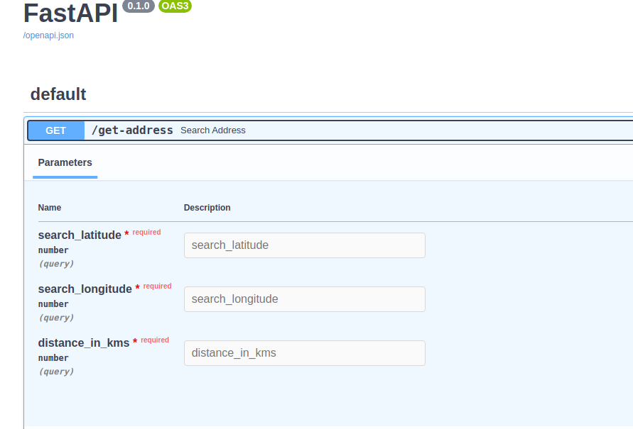

<h1>Address Book API using Fast API!!</h1>

**Installation and setup:**
- Make sure python/pip is installed in the system. if not refer this: https://wiki.python.org/moin/BeginnersGuide/Download
- Once python is installed, make a folder, inside that create a virtual environment, for linux run:
  ``` 
  python3 -m venv fast
  ```
  This will create the python environment named fast.
- Now run this command to activate the virtual environment
  ```
  source fast/bin/activate
  ```
- Clone this repo
  ```
  git clone https://github.com/rishiqwerty/address-book-fast-api.git
  ```

**To run the server:**
- Go to repo folder and run:
  ```
  uvicorn main:app --reload
  ```

Now if you visit http://127.0.0.1:8000/docs or any available port in your system. You will find this page


- Here to add new address create route can be used, in which user can enter person_name, address, its cordinates.


- To update/delete we need to provide address_id for which we are editting.


- To get all the available addresses in db get / route can be used


- **/get-address** route can be used to search for addresses within the provided distance and the cordinates. Here we take search_latitude, search_longitude, distance_in_kms as input
  - search_latitude, search_logngitude: is the cordinates refering which adresses will be searched
  - distance_in_kms is: is the range till which the addresses will be searched.

